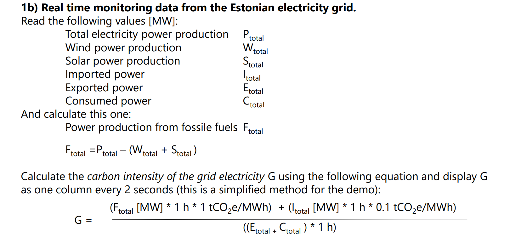

# ReadMe

### Required files/inputs:

1. The Meters dictionary: Data/Meters_dictionary.csv

2. The Model: Model/Model-CNNLSTM.h5

3. The path to save the predictions: Results/preds.csv

4. The Weather Condition dictionary: Data/WeatherCondition_dictionary.csv

5. The Weather Wind dictionary: Data/WeatherWind_dictionary.csv


## Data and Model Overview

### Data
The dataset used in this solution comprises historical energy consumption data from various buildings and weather data from the EEKA station. The data sources are:

- **Elering Dashboard**: Historical energy consumption data was obtained from [Elering Dashboard](https://dashboard.elering.ee).
- **Weather Data**: Weather data was collected from the EEKA station on [Wunderground](https://www.wunderground.com/hourly/EEKA).

For training the model, one year (2022) of historical data from the buildings' consumption was utilized. The final merged columns used for training include:

- `Temperature`
- `Dew Point`
- `Humidity`
- `Wind Speed`
- `Wind Gust`
- `Pressure`
- `Precip.`
- `Wind`
- `Condition`
- `Soome`
- `Läti`
- `Venemaa(Leningrad)`
- `Venemaa(Pihkva)`
- `Tarbimine`
- `Tootmine`
- `Tuuleparkide toodang`
- `Päikeseenergia toodang`
- `month`
- `hour`
- `dayofweek`
- `Meter_code`
- `Meter_consumption`

### Model
The predictive model utilized in this solution is a Convolutional Neural Network (CNN) combined with Long Short-Term Memory (LSTM) architecture. The model is trained to forecast energy consumption based on historical data and external factors such as weather conditions.

- **Model File**: The trained model is saved as `Model/Model-CNNLSTM.h5`.
- **Python Packages**: The solution requires the following Python packages: pandas, numpy, keras, selenium, and bs4.

### Carbon Intensity Calculation
Elering provides planned energy data, allowing for the computation of carbon intensity using the following formula:

G = (f + (I * 0.1)) / (|E| + pred)

Where:
- \( G \) is the carbon intensity.
- \( f \) is the planned energy minus the sum of wind and solar energy predictions.
- \( I \) is the total positive import of energy.
- \( E \) is the total negative export of energy.
- \( pred \) is the predicted energy consumption.

This formula calculates the carbon intensity based on predicted energy consumption, Elering data, and the current datetime.



### Getting Predictions
To obtain predictions for energy consumption, follow these steps:

1. **Replace Paths**: Adjust the paths in the command according to your directory structure.
2. **Run the Script**: Execute the predictions script `Predictions.py` using Python 3, providing the necessary arguments, including the meter name (`--Meter_name`), the new energy consumption value (`--new_value`), and the paths to data dictionaries and the model.
   
### List of Meters names (18 meters in 8 different buildings):

- ICT_JK1_EM1.Total
- ICT_JK1_EM2.Total
- ITK_JK1_EM1.Total
- LIB_JK1_EM1.Total
- LIB_JK1_EM2.Total
- LIB_JK2_EM1.Total
- NRG_JK2_EM1.Total
- NRG_JK2_EM2.Total
- SOC_JK1_EM1.Total
- SOC_JK1_EM2.Total
- SPORT_JK1_EM1.Total
- SPORT_JK1_EM2.Total
- U03_JK1_EM1.Total
- U03_JK1_EM2.Total
- VK1_JK1_EM1.Total
- VK1_JK1_EM2.Total
- VK2_JK1_EM1.Total
- VK2_JK1_EM2.Total


Example Command:
```bash
python3 Predictions.py --Meter_name=ICT_JK1_EM1.Total --new_value=0.08536 --d_path=Meters_dictionary.csv --d_WC_path=Data/WeatherCondition_dictionary.csv --d_WW_path=Data/WeatherWind_dictionary.csv --model_path=Model/Model-CNNLSTM.h5 --pred_path=Results/preds.csv
```

This command will generate predictions for energy consumption based on the specified meter and input value.
